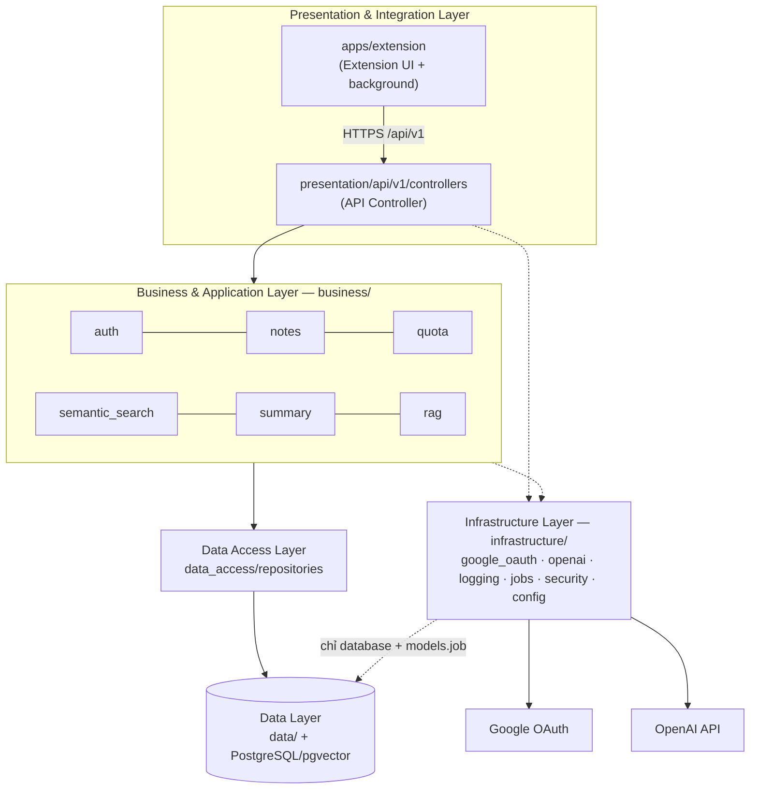

# Kiến trúc QuickAssist — Layered Architecture theo SDS

> Tài liệu sống, cập nhật cùng code. Các quyết định lớn được ghi thành ADR trong [`docs/adr/`](../adr/).
> Những điểm SDS cần chỉnh cho khớp với code: xem [`sds-review.md`](sds-review.md).

## 1. Nguyên tắc

Backend được tổ chức theo **kiến trúc phân tầng (Layered Architecture)**, đúng như **Hình 1 – Sơ đồ kiến trúc logic** trong SDS:

| Tầng (SDS Hình 1) | Thư mục | Trách nhiệm | Không được làm |
|---|---|---|---|
| **Presentation & Integration Layer** — Extension UI, API Controller | `apps/extension/` · `apps/api/src/quickassist/presentation/` | Nhận request, kiểm tra DTO, gọi service rồi trả response; ánh xạ lỗi sang HTTP | Chứa nghiệp vụ, truy cập repository hoặc entity |
| **Business & Application Layer** — AuthService, NotesService, SummaryService, SemanticSearchService, RAGService (+ QuotaService ở §5.2) | `…/business/<service>/` | Nghiệp vụ, transaction (commit/rollback), kiểm quota, phát job | Viết SQL, biết HTTP |
| **Data Access Layer** — RepositoryService | `…/data_access/repositories/` | Truy vấn SQL/ORM; mọi query đều lọc theo `user_id` | Chứa nghiệp vụ, commit |
| **Data Layer** — PostgreSQL + pgvector | `…/data/` (database, models) + `apps/api/migrations/` | Kết nối CSDL, entity, schema | Import tầng trên |
| **Infrastructure Layer** — Google OAuth, OpenAI API, LoggingService | `…/infrastructure/` | Gọi dịch vụ ngoài, config, log, bảo mật, hàng đợi job | Biết nghiệp vụ |

Hệ thống chạy như một **modular monolith** gồm 1 codebase và 2 tiến trình (API, worker); lý do ở [ADR-0001](../adr/0001-modular-monolith.md). Các "service" trong SDS là **thư mục service ở Business Layer**, không phải microservice.

## 2. Sơ đồ phụ thuộc giữa các tầng



Mũi tên chỉ đi **xuống**. Các luật dưới đây được kiểm tra tự động bởi [`apps/api/tests/architecture/test_layers.py`](../../apps/api/tests/architecture/test_layers.py), vi phạm là CI báo đỏ:

| Luật | Nội dung |
|---|---|
| L1 | Mỗi tầng chỉ import các tầng được phép: presentation → business, infrastructure, `data.database` · business → data_access, data, infrastructure · data_access → data · infrastructure → `data.database`, `data.models.job` |
| L2 | Service A gọi service B **chỉ qua** `quickassist.business.B` (public API khai báo trong `__init__.py`) |
| L3 | Không có phụ thuộc vòng giữa các service |
| L4 | Service chỉ dùng **repository mà nó sở hữu** (bảng ở §4) |
| L5 | Business không viết SQL (`select/insert/update/delete/text`) |
| L6 | Repository không `commit()` — service quyết định transaction |
| L7 | Mỗi service khai báo `__all__` (public API) |

## 3. Cây thư mục

```
quick-assist-ext/
├── apps/
│   ├── api/                                   # BACKEND (Python, FastAPI)
│   │   ├── src/quickassist/
│   │   │   ├── main.py                        # composition root — tiến trình API
│   │   │   ├── worker.py                      # composition root — tiến trình worker (job nền)
│   │   │   │
│   │   │   ├── presentation/                  # ① PRESENTATION & INTEGRATION LAYER
│   │   │   │   ├── api/
│   │   │   │   │   ├── deps.py                #    CurrentUserId, DbSession, AIProviderDep
│   │   │   │   │   ├── middleware.py          #    X-Request-ID
│   │   │   │   │   ├── error_handlers.py      #    lỗi nghiệp vụ → HTTP (error contract)
│   │   │   │   │   └── v1/
│   │   │   │   │       ├── router.py          #    gom controller → /api/v1
│   │   │   │   │       └── controllers/       #    "API Controller" (SDS Hình 1)
│   │   │   │   │           ├── auth_controller.py      account_controller.py
│   │   │   │   │           ├── notes_controller.py     folders_controller.py
│   │   │   │   │           ├── search_controller.py    summary_controller.py
│   │   │   │   │           ├── rag_controller.py       quota_controller.py
│   │   │   │   │           └── health_controller.py
│   │   │   │   └── schemas/                   #    DTO request/response (Pydantic)
│   │   │   │
│   │   │   ├── business/                      # ② BUSINESS & APPLICATION LAYER
│   │   │   │   ├── auth/                      #    AuthService + AccountService  (Google OAuth Service)
│   │   │   │   ├── notes/                     #    NotesService + FolderService  (Notes Service)
│   │   │   │   ├── quota/                     #    QuotaService                  (Quota Service, §5.2)
│   │   │   │   ├── semantic_search/           #    SemanticSearchService + chunking + indexing_job
│   │   │   │   ├── summary/                   #    SummaryService + prompts
│   │   │   │   ├── rag/                       #    RAGService (Nice-to-have)
│   │   │   │   ├── system/                    #    HealthService
│   │   │   │   └── common/                    #    exceptions (lỗi nghiệp vụ), idempotency
│   │   │   │
│   │   │   ├── data_access/                   # ③ DATA ACCESS LAYER ("RepositoryService")
│   │   │   │   └── repositories/              #    user, auth_session, folder, note, note_chunk,
│   │   │   │                                  #    quota, idempotency, system
│   │   │   │
│   │   │   ├── data/                          # ④ DATA LAYER
│   │   │   │   ├── database.py                #    engine, session, Base
│   │   │   │   └── models/                    #    entity: user, auth_session, note(folder), note_chunk,
│   │   │   │                                  #    quota, job, idempotency_key
│   │   │   │
│   │   │   └── infrastructure/                # ⑤ INFRASTRUCTURE LAYER
│   │   │       ├── google_oauth/oidc_client.py#    "Google OAuth"
│   │   │       ├── openai/                    #    "OpenAI API": base (port), openai_client, mock_client
│   │   │       ├── logging.py                 #    "LoggingService"
│   │   │       ├── jobs/                      #    hàng đợi job trên Postgres (queue, job_kinds)
│   │   │       ├── security.py                #    JWT, băm refresh token
│   │   │       ├── config.py  errors.py  request_context.py
│   │   │
│   │   ├── migrations/                        # ④ Data Layer — Alembic (schema version)
│   │   └── tests/                             # cấu trúc test bám theo tầng
│   │       ├── architecture/test_layers.py    #    luật L1–L7
│   │       ├── unit/business/  unit/infrastructure/
│   │       └── integration/api/               #    gọi API thật + PostgreSQL/pgvector
│   │
│   └── extension/                             # ① EXTENSION UI (Chrome MV3, TypeScript, React)
│       └── src/
│           ├── ui/              # giao diện: popup, sidepanel, features/<tính năng>, components/
│           ├── background/      # integration: cổng DUY NHẤT gọi API Controller (token, outbox, sync)
│           ├── content/         # hàm tiêm vào trang (lấy vùng chọn, toast hoàn tác)
│           └── shared/          # hợp đồng: messaging (UI↔background), api (kiểu sinh từ OpenAPI), storage
│
├── docs/
│   ├── specs/          # TÀI LIỆU GỐC: SDS_Nhomx.pdf, SDS mẫu, kịch bản chức năng, báo cáo ý tưởng, tham khảo
│   ├── plan/           # kế hoạch phân công (xlsx)
│   ├── architecture/   # tài liệu này + sds-review.md
│   ├── adr/            # quyết định kiến trúc
│   └── api/            # quy ước API
├── infra/              # docker-compose, .env.example
├── scripts/            # script sinh tài liệu/kế hoạch, restructure.ps1
└── .github/            # CI, CODEOWNERS, PR template
```

## 4. Đối chiếu SDS ↔ code (traceability)

| Thành phần trong SDS | Vị trí trong code | Bảng sở hữu (repository) |
|---|---|---|
| Hình 1 · Extension UI / Hình 3 · Extension Service | `apps/extension/src/ui`, `background` | IndexedDB (cache, outbox) |
| Hình 1 · API Controller | `presentation/api/v1/controllers/*` | — |
| Hình 1 · AuthService / Hình 3 · Google OAuth Service / §5.2 OAuth Service | `business/auth/` | `users`, `auth_sessions` |
| Hình 1 · NotesService / §5.2 Notes Service | `business/notes/` | `folders`, `notes` |
| §5.2 Quota Service | `business/quota/` | `quota_accounts`, `quota_ledger` |
| Hình 1 · SemanticSearchService / §5.2 Semantic Search Service | `business/semantic_search/` | `note_chunks` (pgvector) |
| Hình 1 · SummaryService / Hình 3 · AI Service (Summary) | `business/summary/` | — (lưu qua NotesService) |
| Hình 1 · RAGService / Hình 3 · AI Service (RAG) | `business/rag/` | (sắp có) `chat_sessions`, `chat_messages` |
| Hình 1 · RepositoryService (Data Access Layer) | `data_access/repositories/` | — |
| Hình 1 · PostgreSQL và pgvector (Data Layer) / §6 Thiết kế dữ liệu | `data/models/`, `migrations/` | — |
| Hình 1 · Google OAuth (Infrastructure) | `infrastructure/google_oauth/` | — |
| Hình 1 · OpenAI API (Infrastructure) | `infrastructure/openai/` | — |
| Hình 1 · LoggingService (Infrastructure) | `infrastructure/logging.py` | — |
| §4.2 API + worker tách tiến trình | `main.py`, `worker.py`, `infrastructure/jobs/` | `jobs` |
| §5.1.1 Đăng nhập Google OAuth | `auth_controller` → `AuthService.login_with_google` | |
| §5.1.2 Lưu ghi chú + embedding | `notes_controller` → `NotesService.create` → job → `semantic_search/indexing_job.py` | |
| §5.1.3 Tìm kiếm ngữ nghĩa | `search_controller` → `SemanticSearchService.retrieve` | |
| §5.1.4 Tóm tắt AI | `summary_controller` → `SummaryService.summarize`; lưu: `PUT /notes/{id}/summary` | |
| §5.1.5 Xoá tài khoản | `account_controller` → `AccountService.delete_account` | |
| §5.1.6 Hỏi đáp RAG | `rag_controller` → `RAGService` (TODO X01) | |

## 5. Ví dụ một request đi qua các tầng: lưu ghi chú (SDS §5.1.2)

```
Extension (background)  POST /api/v1/notes  + Idempotency-Key
  └─① presentation/api/v1/controllers/notes_controller.py   NoteCreateIn → CreateNoteCommand
      └─② business/notes/notes_service.py                     kiểm thư mục, idempotency, làm sạch nội dung
          ├─③ data_access/repositories/note_repository.py      INSERT notes
          ├─⑤ infrastructure/jobs (enqueue)                    INSERT jobs — CÙNG transaction
          └─   commit
  ← 201 NoteOut (index_status = PROCESSING)

Worker  ⑤ infrastructure/jobs/queue.py  lấy job (SKIP LOCKED)
  └─② business/semantic_search/indexing_job.py
      ├─② business/quota (reserve)                             hết quota → SKIPPED
      ├─⑤ infrastructure/openai (embed)
      ├─③ note_chunk_repository.replace_for_note               INSERT note_chunks (vector)
      ├─② business/notes.set_index_status                      READY
      └─② business/quota (commit usage thật)
```

## 6. Thêm tính năng mới đúng tầng

| Muốn… | Làm ở đâu (theo thứ tự từ dưới lên) |
|---|---|
| Thêm bảng | `data/models/<entity>.py` → `alembic revision --autogenerate -m "<service>: …"` |
| Thêm truy vấn | `data_access/repositories/<entity>_repository.py`, rồi khai báo vào `OWNERSHIP` trong `test_layers.py` |
| Thêm nghiệp vụ | `business/<service>/…_service.py`, export trong `business/<service>/__init__.py` |
| Thêm endpoint | `presentation/schemas/<x>.py` (DTO) + `presentation/api/v1/controllers/<x>_controller.py`, đăng ký trong `router.py` |
| Gọi dịch vụ ngoài | `infrastructure/<tên>/…` (ném lỗi hạ tầng, business dịch sang lỗi nghiệp vụ) |
| Việc chạy nền | tên job ở `infrastructure/jobs/job_kinds.py`, handler ở `business/<service>/*_job.py`, nạp trong `worker.load_job_handlers()` |
| Màn hình mới (extension) | `ui/features/<tên>/`; cần dữ liệu → thêm RPC trong `shared/messaging/protocol.ts` + handler trong `background/handlers.ts` |

## 7. Phân công theo thư mục (khớp CODEOWNERS và kế hoạch v2)

| Thành viên | Sở hữu |
|---|---|
| Lê Đăng Sơn — Tech Lead / Extension | `apps/extension/src/{background,content,shared}`, `ui/features/{search,chat}`, `.github/`, `docs/adr/` |
| Trịnh Mạnh Quang — Backend | `presentation/` (controllers, schemas), `business/{auth,notes,system,common}`, `data/`, `data_access/` (trừ quota, note_chunk), `infrastructure/{google_oauth,jobs,config,logging,security}`, `migrations/`, `infra/` |
| Mai Đức Vinh — AI/RAG | `business/{semantic_search,summary,rag,quota}`, `data_access/repositories/{note_chunk,quota}_repository.py`, `data/models/{note_chunk,quota}.py`, `infrastructure/openai/`, controller search/summary/rag/quota |
| Trần Thùy Dương — UI/UX & QA | `apps/extension/src/ui/` (trừ search/chat), `apps/api/tests/integration/`, `docs/qa/` |

Muốn sửa ngoài phần của mình thì mở PR và để owner phần đó duyệt.
